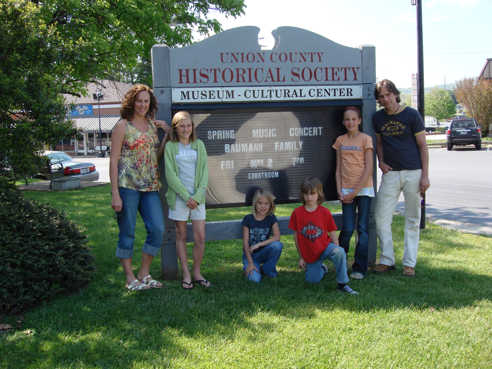
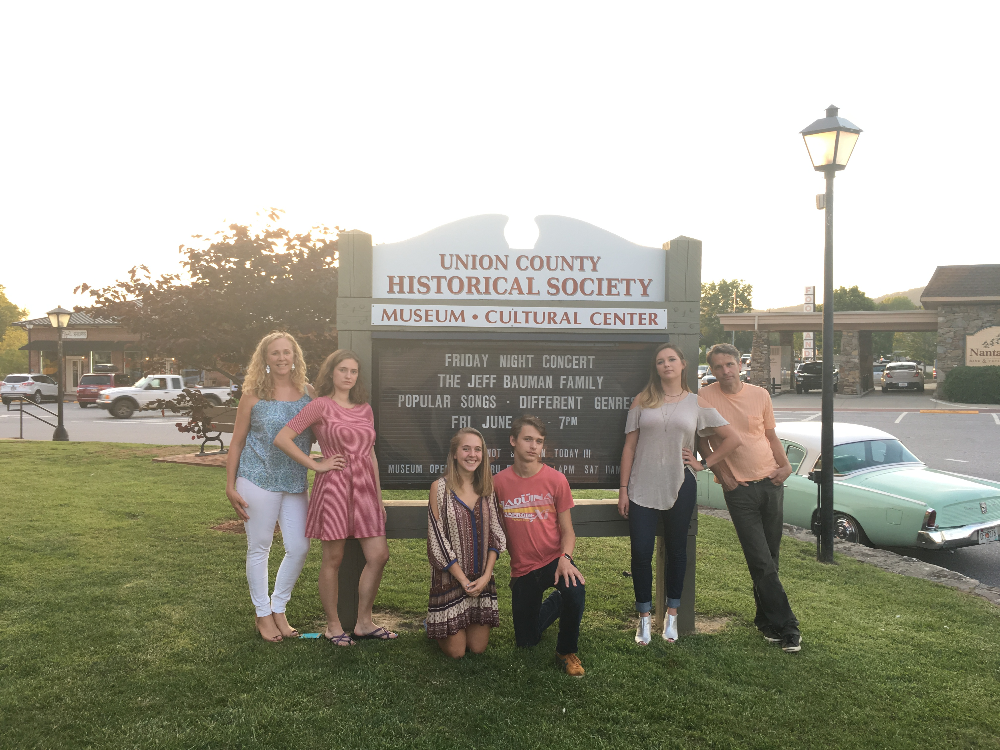
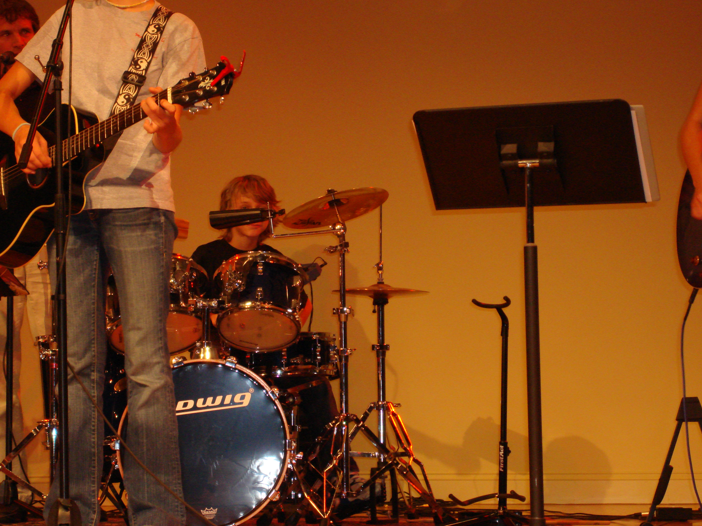
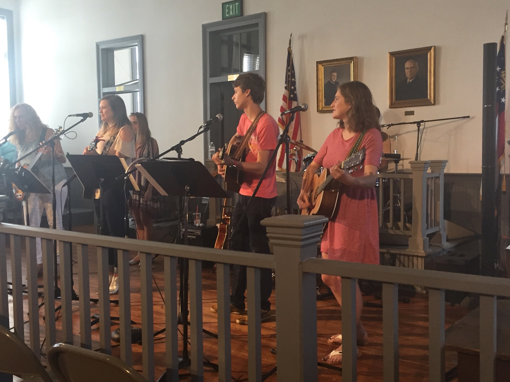
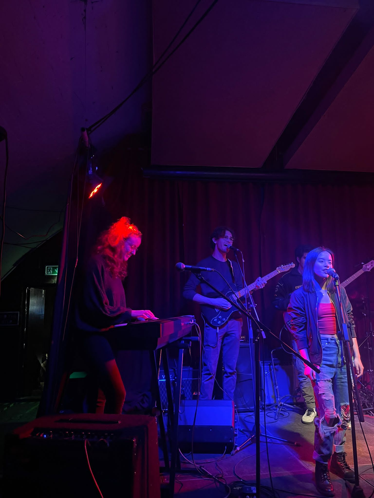
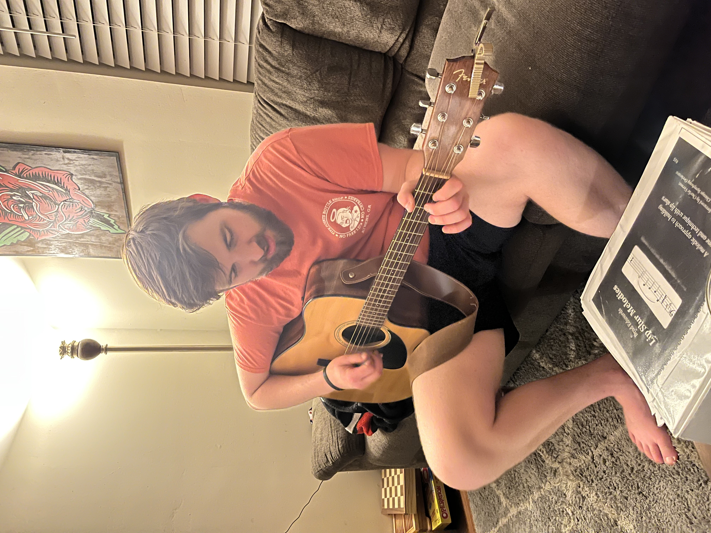

# Milo Bauman Music Database Archive

This is an archive of my music setlists over the years. [Here](https://mjearlb.github.io/music/) is a link to the user-friendlier version of the archive.  
Enjoy! :-)  

## History 
### Bauman Family Band
The Bauman Family Band started in 2003 and still plays together occassionally. For many years, we played a big summer concert at the Union County Historical Court House on the Square in Blairsville, GA. Nowadays, we mostly play at home and occassionally at church.  

I started learning to play the guitar in 2004. The first songs I learned were "The Streets of Lorado" and "The Wreck of the Edmund Fitzgerald." From 2007 to around maybe 2014, I would mostly play drums and occassionally play guitar.  

From 2014 to 2020, I played probably half and half. After 2020, I got serious about learning guitar and now play guitar on almost every song we do. Sometimes, I will still play the drums on our older songs or when I think it would be fun (like Desperado). Very rarely, I may hop on piano just to fill out the sound a little. 

### Milo Bauman & Andrew Mappes (and Other Various Side Projects)
Andrew and I started playing together in early 2020, but did not start recording & archiving our sets until 2/14/2021. [Here is a YouTube playlist](https://www.youtube.com/playlist?list=PLIhbIuts5_rFByYK18eHek4BJYBYfDsvh) containing almost all of our audio recordings. 

Our first big show was at Mapfest 2021, which was also our first time playing with a drummer. From 4/20/22 to 2/17/23, Andrew and I stopped playing together. During this time, I had a semester abroad in Liverpool, England, where I was a part of the "Exchange" band. 

2023 and 2024 would see a large volume of acoustic sets for us. This was due to the fact that both of us were living places that we couldn't be as loud as we might be with electric instruments. This, and the fact that Andrew bought a very nice acoustic guitar. 

Since January 2025, we have agreed to meet at least once a month to play music together, a streak we have not yet broken (as of June 2026). In my opinion, this consistency has resulted in some of our finest performances and improvisation. 
